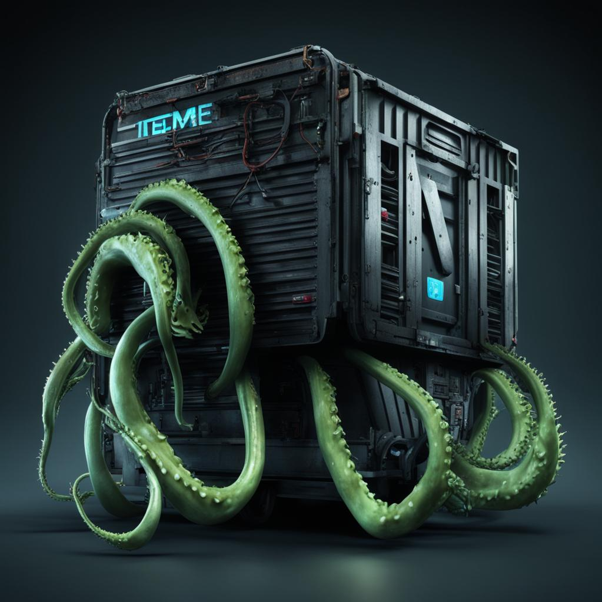

# trial_k8s_terraform_helm



Welcome to the Kubernetes, Terraform, and Helm Playground repository! This repository serves as a hands-on environment for experimenting with container orchestration, infrastructure provisioning, and application deployment using Kubernetes, Terraform, and Helm.

Docker-compose run dockerfile docker file create k8s then

Clean step (optional):
```bashdocker-compose -f compose.yml down --rmi all
```

1. Create local docker registry

```bash
docker-compose -f compose.yml up --force-recreate -d registry
```

2. Tag and Push the Image to the Local Registry
```bash
sh push_to_local_registry.sh
```

3. Run Kubernetes, Terraform, and Helm
```bash
docker-compose -f compose.yml up --force-recreate -d
```